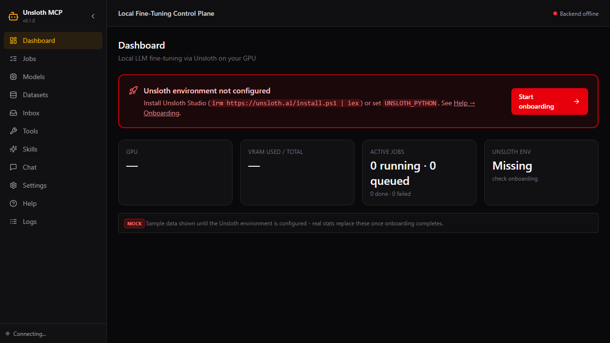
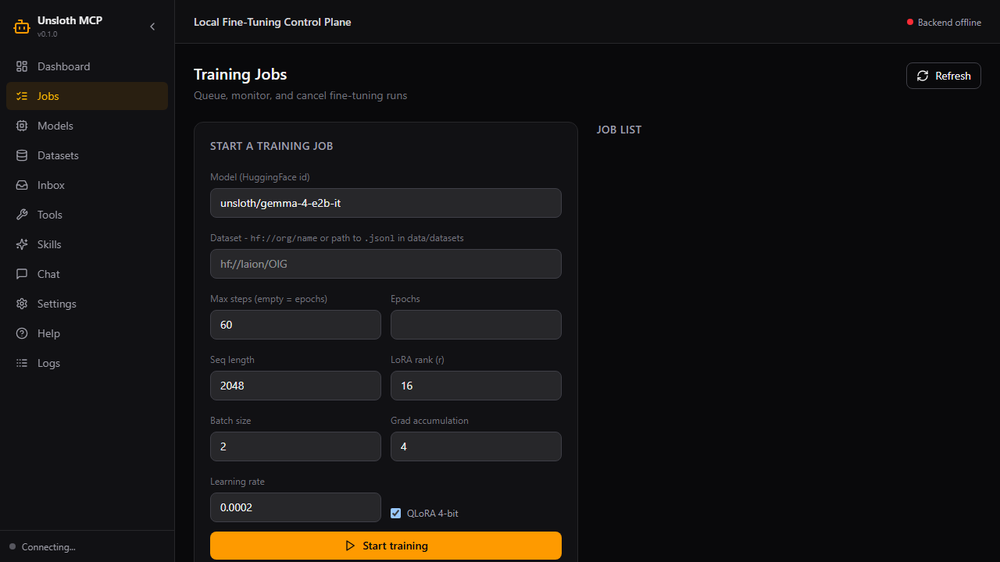

# unsloth-mcp

Local LLM **fine-tuning** for the fleet: train LoRA/QLoRA models on your
NVIDIA GPU with Unsloth, monitor jobs, export GGUF, and register finished
models into Ollama — all from Claude Desktop, Cursor, or the webapp.

## What this wraps

Wraps [Unsloth](https://unsloth.ai) (open-source LLM fine-tuning stack) and
Ollama (model serving). Training runs as background jobs in the Unsloth
environment; the MCP server is the control plane.

## Preview

| Dashboard | Jobs |
|-----------|------|
|  |  |

## What You Can Do

- **Train** — start QLoRA fine-tunes on Gemma 4, Qwen3.5, Llama 3.x, gpt-oss, DeepSeek-V4-Flash (GRPO-ready stack)
- **Monitor** — live job queue: status, logs, loss progress, cancellation
- **Export** — GGUF quantized models from any finished training run
- **Serve** — register exports in Ollama; instantly available to every fleet webapp
- **Know your GPU** — VRAM headroom and VRAM-guard before every run

## Quick Install

See [INSTALL.md](INSTALL.md) for all paths. Fastest:

```powershell
git clone https://github.com/sandraschi/unsloth-mcp
cd unsloth-mcp
uv sync
uv run python -m unsloth_mcp.server
```

## Example Prompts

1. "Check my GPU and the Unsloth environment" → `unsloth_ops(operation="system")`
2. "Fine-tune Gemma 4 E2B on my notes, 60 steps" → `train` with `hf://laion/OIG`
3. "How's training going?" → `jobs_status`
4. "Export the result and put it in Ollama as gemma-notes:q4_k_m" → `jobs_export` + `jobs_register_ollama`

## Documentation

| Doc | Contents |
|-----|----------|
| [Installation](INSTALL.md) | All install methods, prerequisites |
| [Onboarding](docs/ONBOARDING.md) | First-time GPU/Unsloth setup, MOCK-badge policy |
| [Architecture](docs/ARCHITECTURE.md) | Job queue, transports, data flow, ports |
| [Configuration](docs/CONFIGURATION.md) | Env vars, config options |
| [Tool Reference](docs/TOOLS.md) | All available tools and operations |
| [Development](docs/DEVELOPMENT.md) | Contributing, local setup |
| [Troubleshooting](docs/TROUBLESHOOTING.md) | Common issues |

## Requirements

- Windows 10/11 or Linux/WSL with an **NVIDIA GPU** (RTX 30/40/50; 24 GB recommended)
- **Unsloth** installed (`irm https://unsloth.ai/install.ps1 | iex` or pip) — see [Onboarding](docs/ONBOARDING.md)
- **Ollama** for model serving (optional but recommended)
- Python 3.11–3.13 + uv

## License

Apache-2.0 (this server). Unsloth core is Apache-2.0; Unsloth Studio UI is AGPL-3.0.
